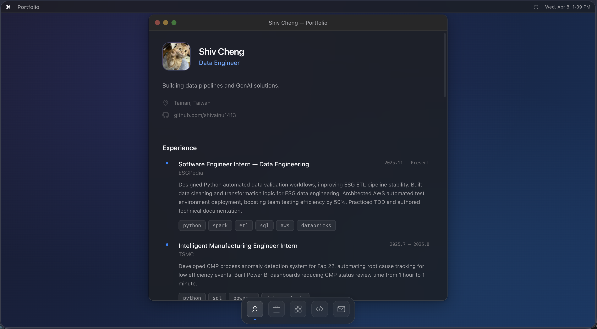

# personal-page

My personal site. macOS-style single window, dark/light theme, and a portfolio section that pulls itself from GitHub so I don't have to update it by hand.

Built with Next.js 14, TypeScript, and Tailwind. Deployed on Vercel.



## How the portfolio auto-updates

Any repo of mine tagged with the `portfolio` topic shows up here automatically. For richer info (cover image, status, highlights, ordering) I drop a `portfolio.json` in the repo root — see `portfolio-template/` for the format.

The page is built with SSG and refreshes on the client via SWR, so new tags propagate quickly without paying the full GitHub API cost on every visit.

## Run locally

```bash
npm install
npm run dev
```

Edit `src/data/profile.ts` for personal info.

If you hit GitHub rate limits while developing, drop a token in `.env.local`:


## Adding a project

1. Add the `portfolio` topic to the repo on GitHub.
2. (Optional) Copy `portfolio-template/portfolio.json` to the repo root and fill it in.
3. (Optional) Drop a `cover.png` next to it for the card image.

Next build picks it up.

## Deploy

Push to GitHub, import on Vercel. That's it.

For instant rebuilds when a portfolio repo changes, see `.github/workflows/notify-portfolio.yml` — copy it into the portfolio repo and set `PERSONAL_PAGE_TOKEN` in its secrets.
